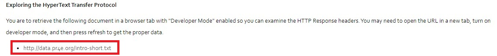

# Graded Assessment

## Steps:
 
1. Open your browser and go to the URL: http://data.pr4e.org/intro-short.txt.
   

2. Enable Developer Mode:
   - For Chrome: Right-click on the page and select "Inspect", then go to the "Network" tab.
   - For Firefox: Right-click on the page and select "Inspect Element", then go to the "Network" tab.
     

3. Refresh the page while the Network tab is open.

4. Click on the request for intro-short.txt to see the HTTP response headers.

6. Locate the following headers and copy their values:

Last-Modified
ETag
Content-Length
Cache-Control
Content-Type

5. Copy all details required paste and submit.
6. Come back to coursera course dashboard and refresh.
